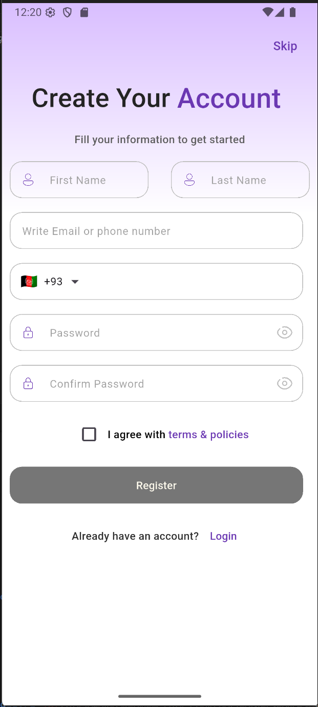
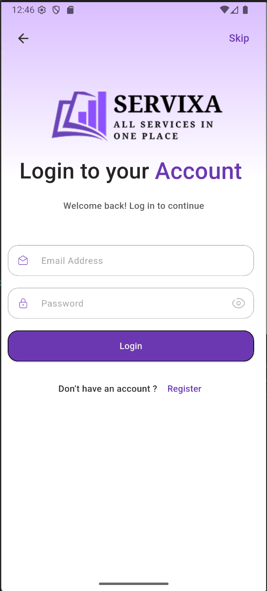
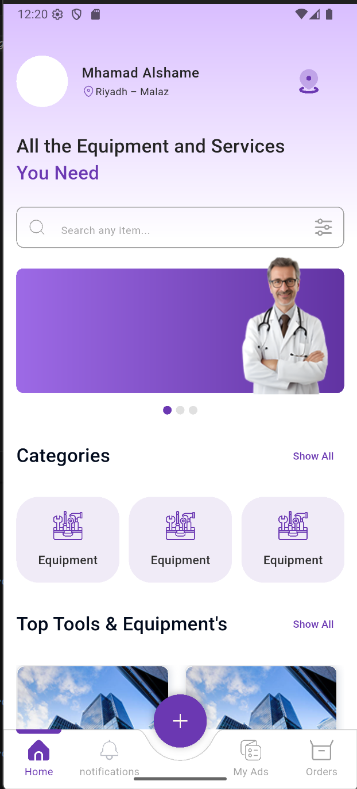
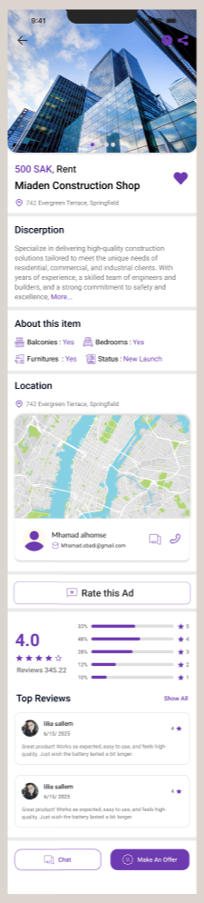
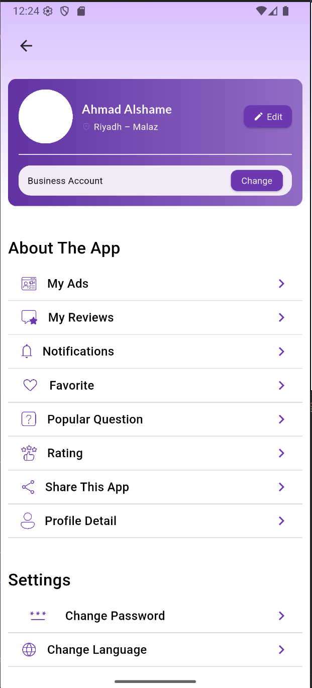
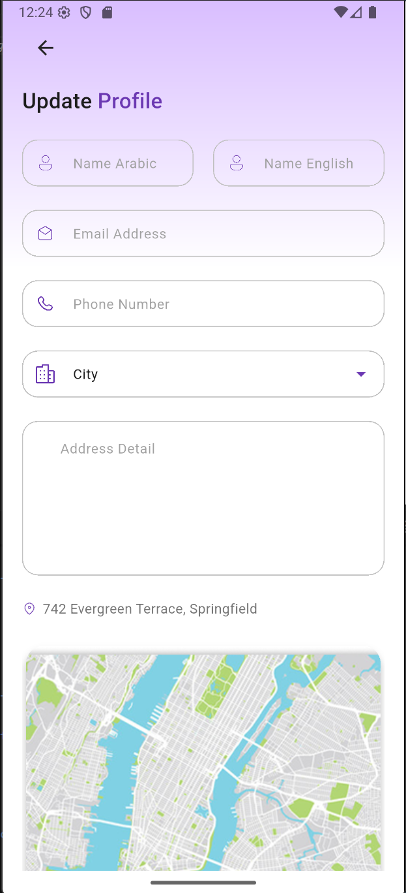
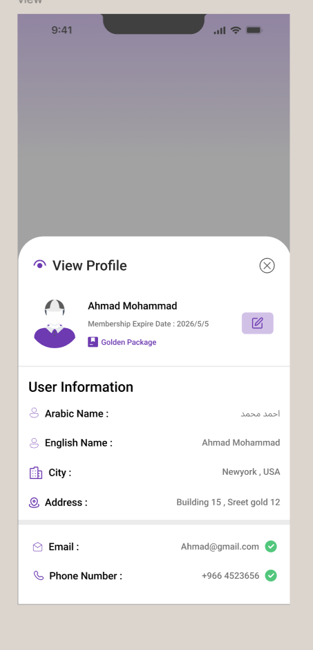

# Real Estate Services App 🏡

## Project Summary
Real Estate Services App is a comprehensive mobile application for managing and offering real estate services. Users can browse, request, and manage properties while admins and managers can control users, services, and operations. The app is built using **Flutter** and **GetX** for state management, following Clean Code and Clean Architecture principles.  

This project is currently under development as part of my internship at **Tamkeen – Syrian Programmer Company**.

---

## Features

### User Management
- Create new accounts with essential details (name, email/phone, password).  
- Login & logout functionality.  
- Dynamic roles & permissions (Admin, Manager, User).  

### Property Services
- Add, edit, and delete properties.  
- Full property details (type, price, currency, images, location).  
- Dynamic classification and branch management.  

### Request Management
- Submit service requests.  
- Approve or reject requests.  
- Delete or modify requests based on status.  

### OTP Verification
- Account activation via OTP sent to email or phone.  

### Ratings & Reviews
- Rate and review services.  
- Display user feedback clearly.  

### Admin Dashboard
- Full management of users, requests, services, and branches.  
- Verification & quality checks before approving services.  

### Media & Documentation
- Upload property images and additional documents.  

### Mobile Friendly
- Responsive UI for mobile devices.  

---

## Technologies
- Flutter & Dart
- GetX (State Management)
- Clean Architecture principles

---

## Screenshots










---

## Installation

1. Clone the repository:
```bash
git clone https://github.com/YomnaAlMajzoub/real_estate_app.git
